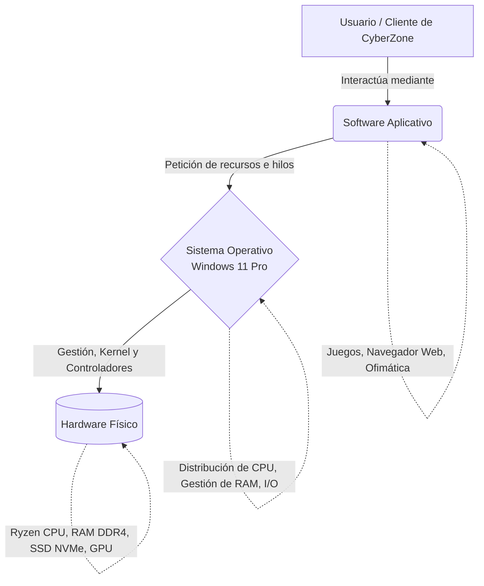

# ABP-PLATAFORMA-HARD-Y-SOFT-

```mermaid
flowchart TD
    A[Usuario / Cliente de CyberZone] -->|Interactúa mediante| B(Software Aplicativo)
    B -->|Petición de recursos e hilos| C{Sistema Operativo\nWindows 11 Pro}
    C -->|Gestión, Kernel y Controladores| D[(Hardware Físico)]
    
    B -.->|Juegos, Navegador Web, Ofimática| B
    C -.->|Distribución de CPU, Gestión de RAM, I/O| C
    D -.->|Ryzen CPU, RAM DDR4, SSD NVMe, GPU| D
``` 
