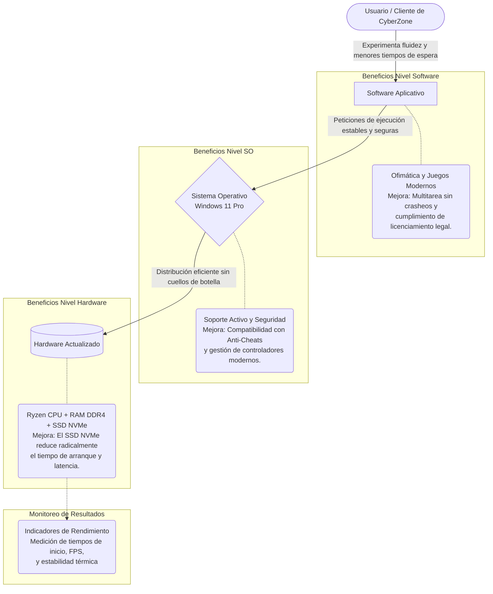

```mermaid
flowchart TD
    A([Usuario / Cliente de CyberZone]) -->|Experimenta fluidez y menores tiempos de espera| B[Software Aplicativo]
    B -->|Peticiones de ejecución estables y seguras| C{Sistema Operativo\nWindows 11 Pro}
    C -->|Distribución eficiente sin cuellos de botella| D[(Hardware Actualizado)]

    subgraph Beneficios Nivel Software
    B -.- B1(Ofimática y Juegos Modernos\nMejora: Multitarea sin crasheos y\ncumplimiento de licenciamiento legal.)
    end

    subgraph Beneficios Nivel SO
    C -.- C1(Soporte Activo y Seguridad\nMejora: Compatibilidad con Anti-Cheats\ny gestión de controladores modernos.)
    end

    subgraph Beneficios Nivel Hardware
    D -.- D1(Ryzen CPU + RAM DDR4 + SSD NVMe\nMejora: El SSD NVMe reduce radicalmente\nel tiempo de arranque y latencia.)
    end
    
    subgraph Monitoreo de Resultados
    D1 -.-> E(Indicadores de Rendimiento\nMedición de tiempos de inicio, FPS,\ny estabilidad térmica)
    end
```
