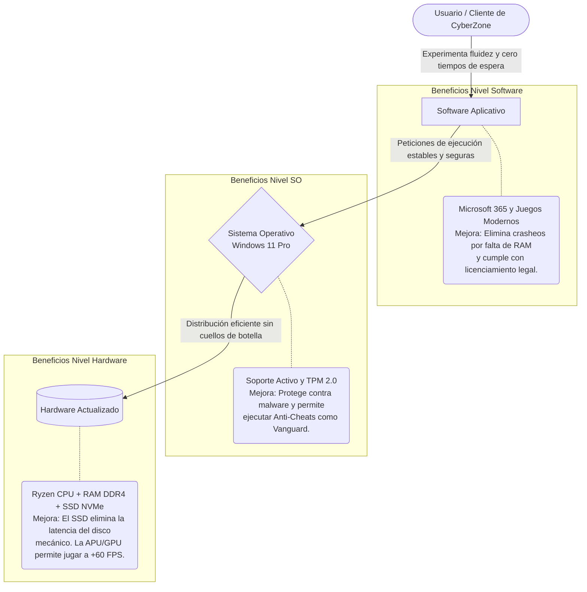

```mermaid
flowchart TD
    A([Usuario / Cliente de CyberZone]) -->|Experimenta fluidez y cero tiempos de espera| B[Software Aplicativo]
    B -->|Peticiones de ejecución estables y seguras| C{Sistema Operativo\nWindows 11 Pro}
    C -->|Distribución eficiente sin cuellos de botella| D[(Hardware Actualizado)]

    subgraph Beneficios Nivel Software
    B -.- B1(Microsoft 365 y Juegos Modernos\nMejora: Elimina crasheos por falta de RAM\ny cumple con licenciamiento legal.)
    end

    subgraph Beneficios Nivel SO
    C -.- C1(Soporte Activo y TPM 2.0\nMejora: Protege contra malware y permite\nejecutar Anti-Cheats como Vanguard.)
    end

    subgraph Beneficios Nivel Hardware
    D -.- D1(Ryzen CPU + RAM DDR4 + SSD NVMe\nMejora: El SSD elimina la latencia del disco\nmecánico. La APU/GPU permite jugar a +60 FPS.)
    end
``` 
